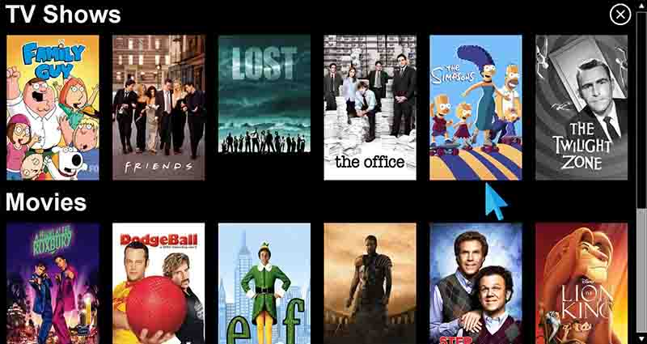

# Local Video Player

* Netflix clone for movies and tv shows saved locally 
* [LibVLCSharp](https://github.com/videolan/libvlcsharp) used to render media
* [The Movie Database (TMDB) API](https://www.themoviedb.org/) used to download images (movie posters, episode backdrops, season posters, etc.) and media descriptions

